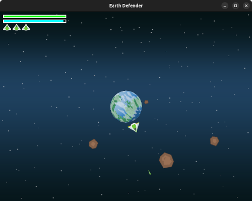

# Earth Defender

This game is inspired by an old flash game named **Clash'N Slash**.



Python version:
- Python 3.11.4

The following packages are needed:
- Pygame >= 2.6.0

## Run the game

I highly recommend to create a virtual environment with the packages needed. You can create and install the packages
with the following commands:
```bash
python3 -m venv ./pygame-venv
source ./pyagme-venv/bin/activate
pip3 install -r requirements.txt
```

Once you have installed the packages run the game:
```bash
python3 earth-defender.py
```

## Resources

The images were downloaded from the following artist:
- https://opengameart.org/content/planets-8
- https://opengameart.org/content/space-shooter-redux